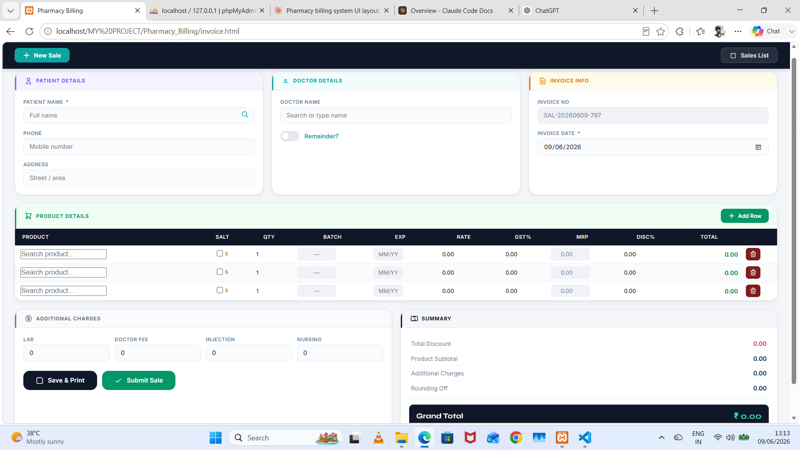
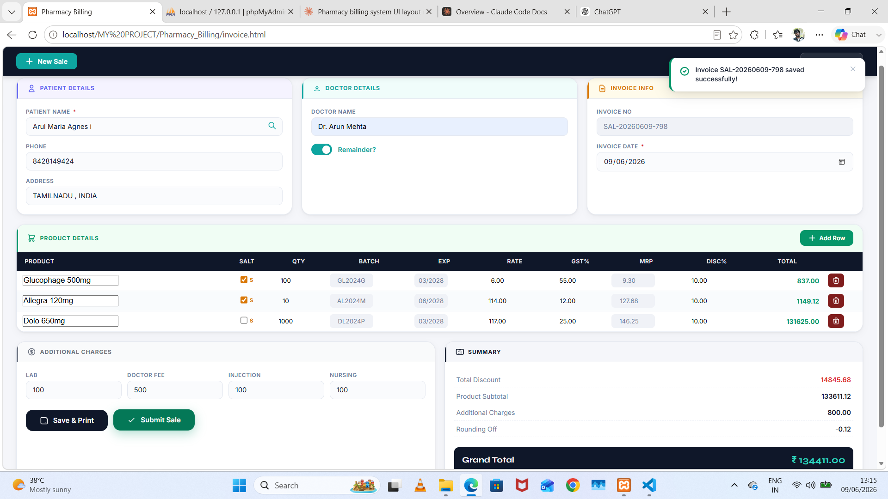
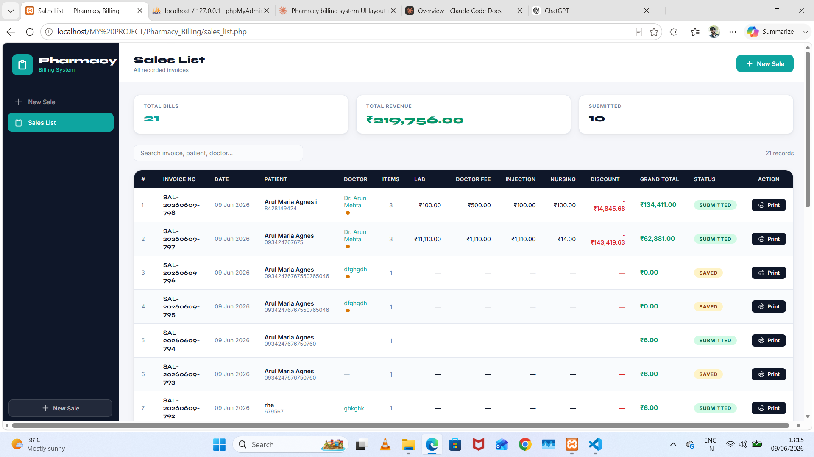
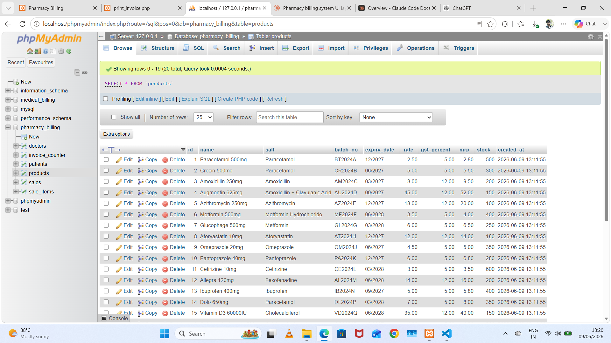
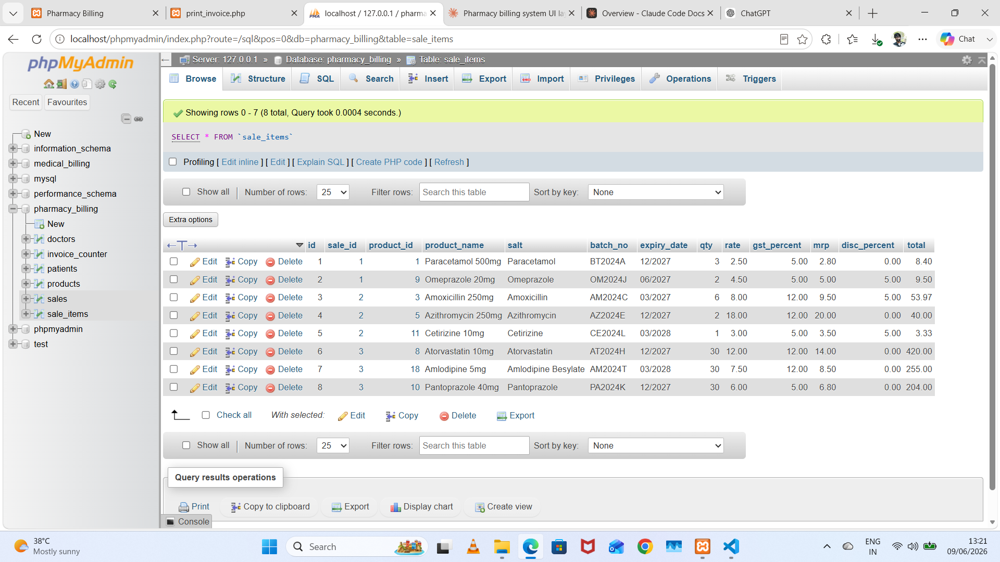

<p align="center">
  
</p>

<div align="center">

[](https://git.io/typing-svg)


</div>

---

## 🌌 Overview

**Pharmacy Billing Website** is a complete end-to-end solution for pharmacy owners to manage **medicine sales, inventory, and billing**.

> Built for real medical stores — Fast, Simple, and Powerful. No more manual registers.

### 🎯 Why This Project?
- Counter-friendly UI for fast billing
- Reduces manual errors in stock & billing
- Real-time database sync for products and sales

---

## 🚀 Features

- 🧾 **New Sale Module** — Auto-calculation, GST, Discount, Invoice generation
- 💊 **Tablet Entry Module** — Add medicine, Batch No, Expiry, MRP, Stock Qty
- 📜 **Sales List** — View all invoices with search, filter by date
- 🗄️ **DB Products View** — Live inventory management, edit/delete
- 🔗 **DB SalesItems View** — Relational tracking of each item in a bill
- 📱 **100% Responsive** — Works on Billing PC, Tablet, Mobile
- 🔐 **Secure PHP & MySQLi Backend**

---

## 🖼️ Project Showcase

### 1. Homepage — New Sale Billing
The main billing interface where cashier adds items and creates invoice.
<p align="center"></p>

### 2. Tablet / Product Entry
Add new tablets with complete details.
<p align="center"></p>

### 3. Sales List
Complete history of invoices and sales records.
<p align="center"></p>

### 4. Database — Products Table
Backend structure of products inventory.
<p align="center"></p>

### 5. Database — Sales Items Table
Relational table connecting sales and products.
<p align="center"></p>

---

## 🛠️ Tech Stack

| Layer | Technology |
|-------|------------|
| **Frontend** | HTML5, CSS3, JavaScript, Bootstrap 5 |
| **Backend** | PHP 8.x, MySQLi |
| **Database** | MySQL, phpMyAdmin |
| **Design** | Glassmorphism, 3D Isometric, FontAwesome |

---

## ⚙️ Installation

```bash
# 1. Clone
git clone https://github.com/ArulAgnes/Pharmacy-Billing-Website.git

# 2. Move to htdocs
C:\xampp\htdocs\Pharmacy-Billing-Website

# 3. Start Apache & MySQL in XAMPP

# 4. Create DB in phpMyAdmin -> pharmacy_db -> Import pharmacy_db.sql

# 5. Edit db.php
$host = "localhost";
$user = "root";
$pass = "";
$dbname = "pharmacy_db";

# 6. Run
http://localhost/Pharmacy-Billing-Website/
📂 Folder Structure
Code
Pharmacy-Billing-Website/
├── Images/
│   ├── banner_3d.png
│   ├── Homepage_newsale.png
│   ├── Tablet_enty.png
│   ├── sales_list.png
│   ├── DB_products.png
│   └── DB_salesitems.png
├── css/
├── js/
├── includes/
│   └── db.php
├── index.php
└── README.md
<div align="center">
👨‍💻 Developed by Arul Agnes
[GitHub](https://github.com/ArulAgnes)
[Portfolio](https://github.com/ArulAgnes/MY-PORFOLIO-3D-ANIMATION)

If you like this project, please give it a ⭐

 </div>


