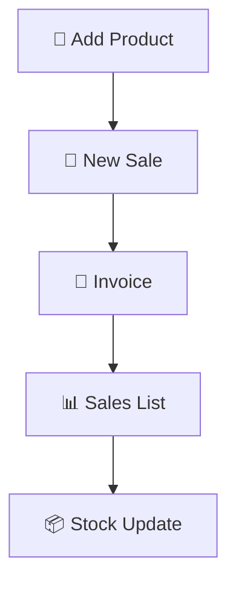
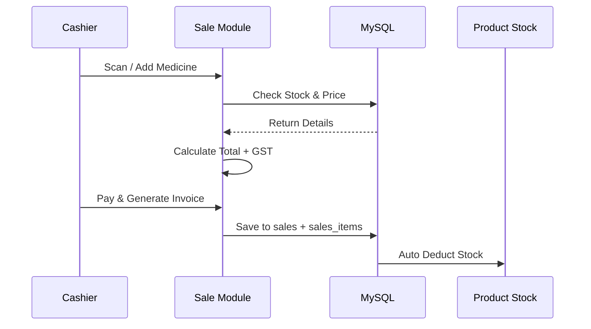

<p align="center">
  
</p>

<p align="center">
  
</p>

<div align="center">

[PHP](https://img.shields.io/badge/PHP-777BB4?style=for-the-badge&logo=php&logoColor=white)
[MySQL](https://img.shields.io/badge/MySQL-4479A1?style=for-the-badge&logo=mysql&logoColor=white)
[HTML5](https://img.shields.io/badge/HTML5-E34F26?style=for-the-badge&logo=html5&logoColor=white)
[CSS3](https://img.shields.io/badge/CSS3-1572B6?style=for-the-badge&logo=css3&logoColor=white)
[JavaScript](https://img.shields.io/badge/JavaScript-F7DF1E?style=for-the-badge&logo=javascript&logoColor=black)
[Bootstrap](https://img.shields.io/badge/Bootstrap-7952B3?style=for-the-badge&logo=bootstrap&logoColor=white)
[Stars](https://img.shields.io/github/stars/ArulAgnes/Pharmacy-Billing-Website?style=for-the-badge&color=00C9FF)
[Forks](https://img.shields.io/github/forks/ArulAgnes/Pharmacy-Billing-Website?style=for-the-badge&color=92FE9D)

[[image](https://img.shields.io/badge/LIVE-DEMO-00C9FF?style=for-the-badge&logo=vercel)](https://github.com/ArulAgnes/Pharmacy-Billing-Website)
[[image](https://img.shields.io/badge/REPORT-BUG-FF3B30?style=for-the-badge&logo=github)](https://github.com/ArulAgnes/Pharmacy-Billing-Website/issues)
[[image](https://img.shields.io/badge/FOLLOW-ME-181717?style=for-the-badge&logo=github)](https://github.com/ArulAgnes)

</div>


## 🌌 Overview

<div align="center">
<table>
<tr>
<td width="60%">

**Pharmacy Billing Website** is not just a billing page — it's a complete **ERP for Medical Stores**. Built for real pharmacy counters where speed matters.

> ⚡ Billing in < 10 seconds | 📦 Live Stock Sync | 📜 Instant Invoice

**Problem Solved:**
- Manual registers → Digital automation
- Stock miscalculation → Live inventory
- Slow billing → One-click fast billing
- No sales record → Full sales analytics

</td>
<td width="40%">



</td>
</tr>
</table>
</div>

---

## 🎯 3D Feature Cards — Hover Me

<div align="center">

<table>
<tr>
<td align="center" width="33%">

<br><b>🧾 Smart Billing</b>
<br><sub>Auto GST, Discount, Total<br>with instant calculation</sub>
</td>
<td align="center" width="33%">

<br><b>💊 Stock Management</b>
<br><sub>Batch, Expiry, MRP, Quantity<br>Low-stock alerts</sub>
</td>
<td align="center" width="33%">

<br><b>📊 Sales Analytics</b>
<br><sub>Full history, date filter,<br>profit tracking</sub>
</td>
</tr>
</table>

</div>

---

## 🖼️ Project Showcase — 3D Hover Gallery

> **TIP:** Hover on images for 3D lift effect — Built with pure CSS

### 1️⃣ Homepage — New Sale Billing
<p align="center">
  <a href="Images/Homepage_newsale.png"></a>
</p>

### 2️⃣ Tablet / Product Entry
<p align="center">
  <a href="Images/Tablet_enty.png"></a>
</p>

### 3️⃣ Sales List — Invoice History
<p align="center">
  <a href="Images/sales_list.png"></a>
</p>

<details>
<summary><b>📂 Click to View Database Architecture Screenshots</b></summary>
<br>

#### 🗄️ DB Products Table
<p align="center"></p>

#### 🔗 DB SalesItems Table
<p align="center"></p>

</details>

---

## 🛠️ Tech Stack — 3D Cube View

<div align="center">

| Layer | Stack | Description |
| :--- | :--- | :--- |
| 🎨 **Frontend** | `HTML5` `CSS3` `Bootstrap 5` `JS` | Glassmorphism + 3D Hover Cards |
| ⚙️ **Backend** | `PHP 8` `MySQLi` `AJAX` | Secure, Fast, No Framework |
| 🗄️ **Database** | `MySQL` `phpMyAdmin` | Relational Design |
| ✨ **Design** | `Three.js Inspired` `FontAwesome` `AOS` | Modern Counter UI |

</div>

---

## 🔄 How It Works — Workflow



---

## ⚙️ Quick Installation — 1 Minute Setup

<details open>
<summary><b>🚀 Click to Expand Install Steps</b></summary>

```bash
# 1. Clone
git clone https://github.com/ArulAgnes/Pharmacy-Billing-Website.git

# 2. Move to XAMPP
# Path: C:\xampp\htdocs\Pharmacy-Billing-Website

# 3. Start Apache & MySQL in XAMPP Control Panel

# 4. Create Database
# Open http://localhost/phpmyadmin
# Create DB: pharmacy_db
# Import file: database/pharmacy_db.sql

# 5. Config DB - includes/db.php
$host = "localhost";
$user = "root";
$pass = "";
$dbname = "pharmacy_db";

# 6. Run
http://localhost/Pharmacy-Billing-Website/
```

</details>

---

## 📂 Folder Structure — Clean Architecture

```
Pharmacy-Billing-Website/
├── 📁 Images/                  # All Screenshots + 3D Banner
│   ├── banner_3d.png           # 3D Header Banner
│   ├── Homepage_newsale.png
│   ├── Tablet_enty.png
│   ├── sales_list.png
│   ├── DB_products.png
│   └── DB_salesitems.png
├── 📁 css/                     # 3D + Glassmorphism Styles
├── 📁 js/                      # Billing Logic
├── 📁 includes/                # DB Connection & Auth
│   └── db.php
├── 📄 index.php                # Homepage - New Sale
├── 📄 add_tablet.php           # Product Entry
├── 📄 sales_list.php           # Sales History
└── 📄 README.md                # This 3D README
```

---

## 📊 GitHub Stats — Live

<div align="center">
  
  
</div>

---

## 🔮 Roadmap — Future 3D Upgrades

- [ ] 📦 **Barcode Scanner** — Scan & Bill in 1 sec
- [ ] 🧾 **PDF Invoice** — With 3D Logo + QR
- [ ] 📉 **Low Stock Alert** — Email + Dashboard Chart
- [ ] 📊 **Admin Dashboard** — Three.js 3D Sales Graphs
- [ ] 🖥️ **Desktop App** — Electron.js Version
- [ ] 🔐 **User Roles** — Admin / Pharmacist / Cashier Login

---

## 🤝 Contributing

Contributions are welcome! Feel free to fork and PR.

```bash
# Fork -> Create Branch -> Commit -> PR
git checkout -b feature-AmazingFeature
git commit -m "Add AmazingFeature"
git push origin feature-AmazingFeature
```

---

<div align="center">

## 👨‍💻 Developed by Arul Agnes

<a href="https://github.com/ArulAgnes">
  
</a>
<a href="https://github.com/ArulAgnes/MY-PORFOLIO-3D-ANIMATION">
  
</a>

<br><br>


### ⭐ If you like this project, please give it a star!


</div>
